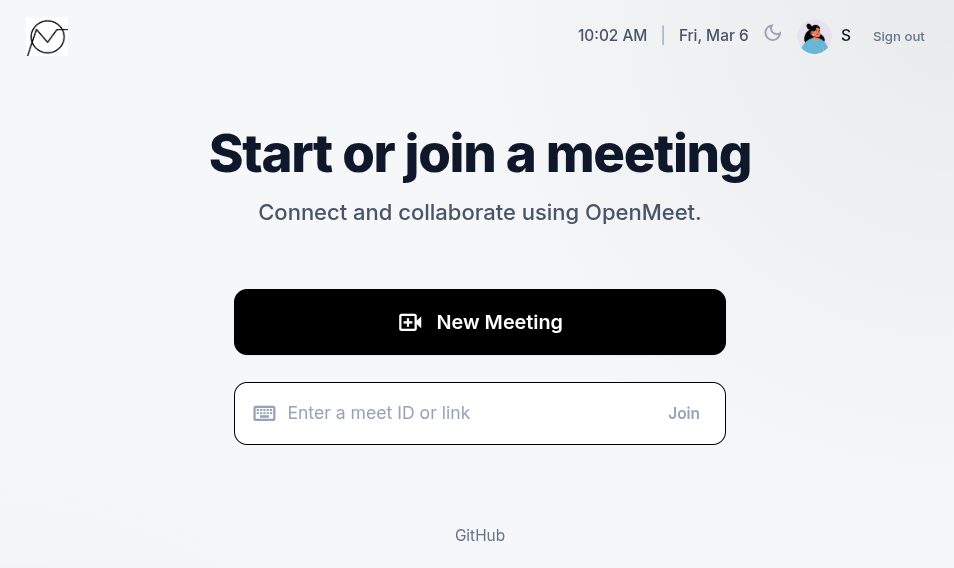

# OpenMeet

A real-time video conferencing platform built in Go, supporting both peer-to-peer 1-to-1 calls and multi-party group meetings via a custom Selective Forwarding Unit (SFU).

## Screenshots

<table>
  <tr>
    <td></td>
    <td></td>
  </tr>
  <tr>
    <td align="center">Home — start or join a meeting</td>
    <td align="center">Choose meeting type (1-to-1 or Group)</td>
  </tr>
</table>

## Features

- **1-to-1 P2P Video Calls** — direct browser-to-browser WebRTC with a Go signaling relay
- **Group Meetings (SFU)** — server-side media routing using [Pion WebRTC](https://github.com/pion/webrtc) for N-party calls
- **Knock / Admit flow** — guests knock, the host admits or denies entry (both P2P and group modes)
- **JWT Authentication** — register, email verification, login, forgot/reset password
- **Real-time mute indicators** — mic and camera state broadcast to all room participants
- **Participant roster** — live room-state sync pushed to every peer on join/leave
- **Responsive UI** — Vue 3 (CDN, no build step) + Tailwind CSS, dark mode

## Tech Stack

| Layer | Technology |
|---|---|
| Backend | Go 1.22 (`net/http`, no framework) |
| WebRTC (SFU) | [Pion WebRTC v4](https://github.com/pion/webrtc) |
| Signaling transport | WebSocket (`gorilla/websocket`) |
| Database | MongoDB Atlas (`mongo-driver`) |
| Auth | JWT (30-day tokens) + bcrypt password hashing |
| Email | SMTP — transactional email for verify/reset flows |
| Frontend | Vue 3 (CDN) + Tailwind CSS (CDN) |
| Dev email | MailHog |

## Architecture

### P2P Mode (`/ws`)

The Go server acts as a pure signaling relay — it never touches media.

```
Browser A  ──WebSocket──▶  Go signaling relay  ◀──WebSocket──  Browser B
               offer/answer/ICE                 offer/answer/ICE
                                    ↓
                         Media flows directly A ↔ B (WebRTC SRTP)
```

1. Host creates a meeting → unique `abc-d3fg-hij` Meet ID generated
2. Guest opens the link → sends a `knock` message over WebSocket
3. Host receives knock notification → clicks Admit → sends `admit` message
4. Guest (offerer) creates SDP offer → Go relays to host (answerer)
5. SDP answer + ICE candidates trickle back through Go relay
6. DTLS/SRTP session established → media flows peer-to-peer

### SFU Mode (`/sfu`)

The Go server terminates WebRTC connections and forwards media, enabling calls with more than 2 participants.

```
Browser A ──WebRTC──▶              ──WebRTC──▶ Browser B
Browser B ──WebRTC──▶  Go SFU (Pion)  ──WebRTC──▶ Browser A
Browser C ──WebRTC──▶              ──WebRTC──▶ Browser A, B
```

**Key components:**

- **`sfu/manager.go`** — global concurrent-safe room registry (`sync.Map`-style); `GetOrCreate(meetID)` is the single entry point
- **`sfu/room.go`** — room lifecycle: `Join`, `Leave`, `Knock/Admit/Deny`, `OnTrack`, `BroadcastRoomState`; all shared state guarded by `sync.RWMutex`
- **`sfu/peer.go`** — per-peer state: Pion `PeerConnection`, WebSocket handle, `AddSenderTrack`, `Renegotiate`, `SendJSON`; outbound WS writes serialized through a mutex
- **`sfu/broadcaster.go`** — `TrackBroadcaster` reads RTP packets from one `TrackRemote` in a single goroutine and fans them out to N `TrackLocalStaticRTP` sinks; sinks are added/removed dynamically as peers join/leave
- **`handlers/sfu.go`** — WebSocket upgrade → Pion `PeerConnection` → room join → offer/answer/ICE message loop; uses a single reader goroutine to avoid concurrent-read races

**SFU signaling flow (per peer join):**

```
Browser           Go SFU (Pion)
  │── offer ──────────▶│  SetRemoteDescription
  │◀─── answer ────────│  CreateAnswer + SetLocalDescription
  │◀──── ice ──────────│  trickle ICE candidates (both directions)
  │── answer ──────────│  (renegotiation answer from browser)
  │                    │  OnTrack fires → broadcaster created
  │                    │  AddSenderTrack on all other peers
  │◀──── offer ────────│  server-initiated renegotiation
  │── answer ──────────│  browser accepts new tracks
```

**Renegotiation:** when a new peer's tracks arrive, the SFU calls `AddSenderTrack` on every existing peer's `PeerConnection` then sends a server-initiated SDP offer — the correct WebRTC mechanism to add m-sections without re-signaling from the browser.

**Track identity:** forwarded `TrackLocalStaticRTP` objects carry the sender's `peerID` as their stream ID. The browser reads `track.streams[0].id` to identify which participant a track belongs to and renders it in the correct video tile.

### Authentication & Middleware

- `middleware/auth.go` — extracts JWT from `Authorization` header, cookie, or `?token=` query param; injects `userID` into `context.Context`
- All WebSocket endpoints (`/ws`, `/sfu`) require a valid JWT — the token is validated before the WebSocket upgrade
- Passwords hashed with bcrypt; email verification tokens are single-use JWTs

### Concurrency model

- Each room's peer map is protected by a `sync.RWMutex` (read-heavy: broadcast operations; write: join/leave)
- Broadcaster sinks guarded by a separate `bcMu sync.RWMutex` to avoid contention during track fan-out
- Knock/admit state uses a dedicated `knockMu sync.Mutex` and per-knock `chan bool` for backpressure-free notification
- Outbound WebSocket writes on each peer are serialized through a `sync.Mutex` — gorilla/websocket does not allow concurrent writes
- One goroutine per broadcaster reads RTP and copies to all sinks; a `sync.RWMutex` protects the sink map

## Project Structure

```
.
├── main.go                  # Route wiring only
├── config/config.go         # .env loader (PORT, MONGODB_URI, JWT_SECRET, SMTP_*)
├── db/mongo.go              # MongoDB Atlas client + collection accessors
├── middleware/auth.go       # JWT middleware (header / cookie / query param)
├── models/user.go           # User model
├── handlers/
│   ├── auth.go              # Register, VerifyEmail, Login, ForgotPassword, ResetPassword, Me
│   ├── ws.go                # P2P WebSocket signaling relay
│   ├── sfu.go               # SFU WebSocket handler (group meetings)
│   └── meet_info.go         # REST: active participant count per room
├── sfu/
│   ├── manager.go           # Global room registry
│   ├── room.go              # Room: peers, broadcasters, knock/admit
│   ├── peer.go              # Per-peer PeerConnection + WS wrapper
│   └── broadcaster.go       # RTP fan-out (one reader → N sinks)
├── email/smtp.go            # Transactional email (verification + password reset)
└── static/
    ├── index.html           # Vue 3 SPA (12 screens)
    ├── app.js               # All client-side logic: auth, WebRTC, SFU, UI state
    └── avatars/             # Local avatar images
```

## Running locally

```bash
# Prerequisites: Go 1.22+, MongoDB Atlas URI, MailHog (optional)
cp .env.example .env        # fill in MONGODB_URI, JWT_SECRET, SMTP_*, APP_URL
go run main.go              # → http://localhost:8080
```

**Environment variables:**

| Variable | Description |
|---|---|
| `PORT` | HTTP listen port (default `8080`) |
| `MONGODB_URI` | MongoDB Atlas connection string |
| `JWT_SECRET` | HMAC secret for token signing |
| `SMTP_HOST` | SMTP server host |
| `SMTP_PORT` | SMTP server port (`1025` for MailHog) |
| `SMTP_FROM` | From address for transactional emails |
| `APP_URL` | Base URL used in email links |

## WebRTC Implementation Notes

- **STUN:** `stun:stun.l.google.com:19302` (no TURN deployed — works on same-network / direct connectivity)
- **Codecs:** negotiated by the browser; Pion accepts whatever the browser offers (VP8/VP9/H.264 for video, Opus for audio)
- **ICE:** trickle ICE on both paths; candidates exchanged as JSON over the WebSocket connection
- **SDP answer constraint:** a WebRTC answer cannot introduce new m-sections beyond those in the offer — the SFU therefore sends a clean answer first, then uses a server-initiated re-offer to add forwarded tracks

## Meet ID format

`abc-d3fg-hij` — three segments (3-4-3 characters), lowercase alphanumeric, inspired by Google Meet.
